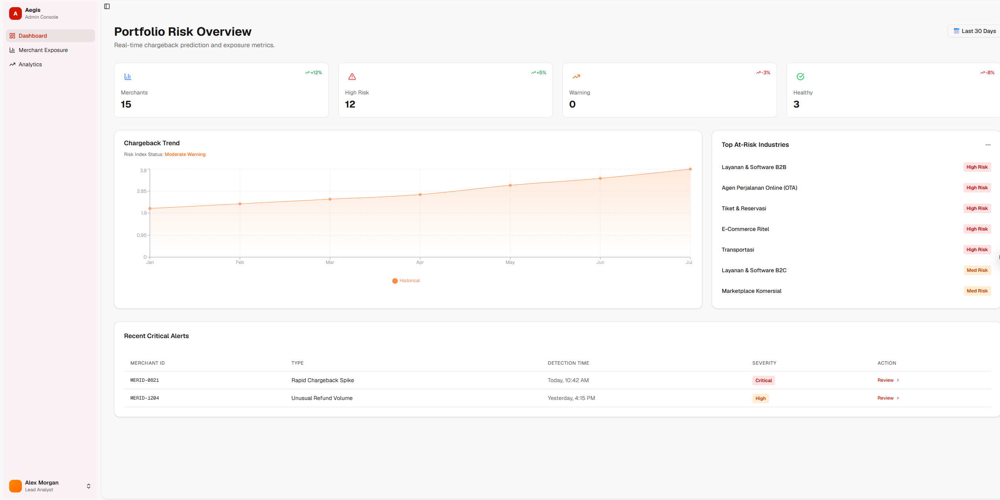
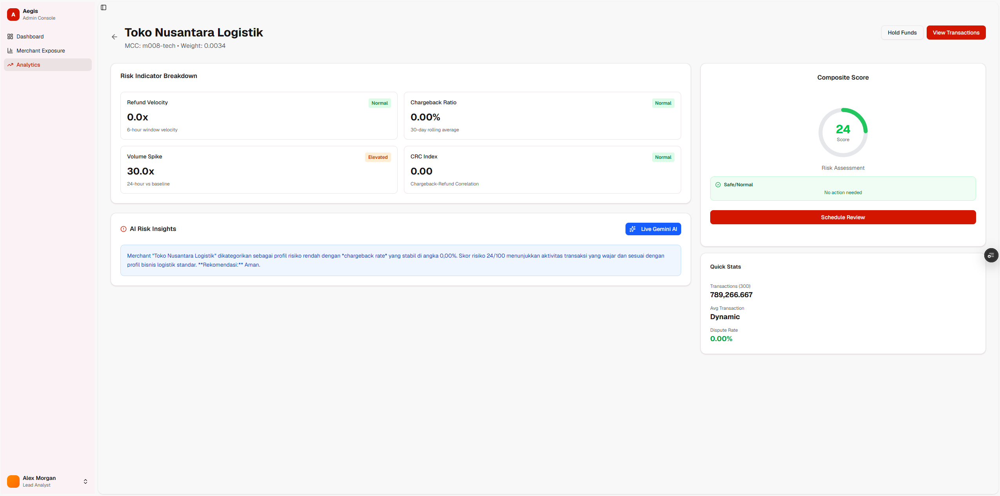
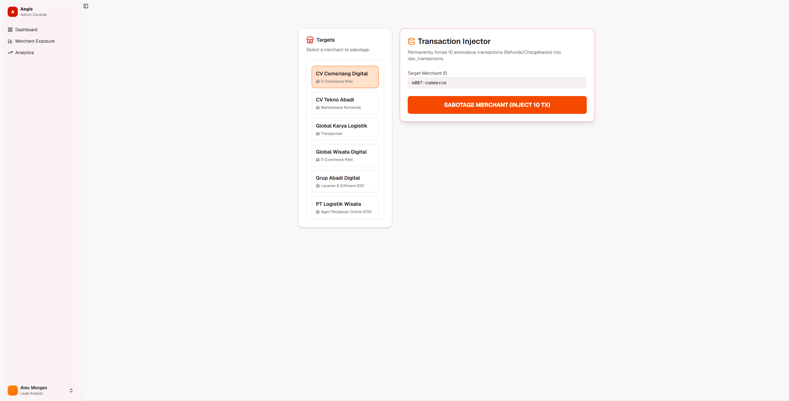
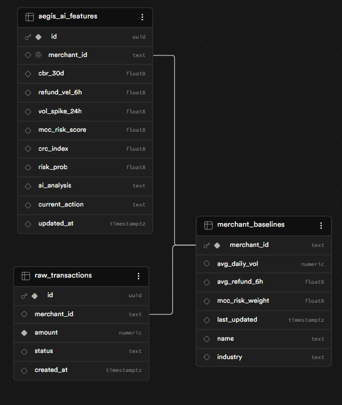

# 🛡️ Aegis - AI Merchant Risk Intelligence & Anti-Fraud Dashboard

[](https://aegis-five-pied.vercel.app/)

Aegis adalah platform **Sistem Monitoring & Manajemen Risiko Merchant (Anti-Fraud)** real-time yang bertujuan untuk dapat digunakan oleh **Paylabs** dalam memonitoring setiap merchant guna mengatasi lonjakan _chargeback_ (dispute) dan mendeteksi secara dini potensi kaburnya merchant nakal (fraud/default). Aegis ditenagai oleh kecerdasan buatan **Google Gemini AI (Gemini 3.1 Flash Lite)** serta model Machine Learning (ML) berbasis Python.

🔗 **Link Demo Live:** [https://aegis-five-pied.vercel.app/](https://aegis-five-pied.vercel.app/)

---

## 📸 Screenshots & UI Preview

### 1. Portfolio Risk Overview Dashboard

> Menampilkan ringkasan kesehatan portofolio merchant, grafik tren chargeback bulanan, dan kategori industri dengan risiko tertinggi.
>
> 

### 2. Merchant Intelligence Detail & Gemini AI Insights

> Detail analisis risiko untuk merchant terpilih. Memuat rincian Refund Velocity, Volume Spike, Chargeback Ratio, serta analisis naratif otomatis menggunakan Gemini AI.
>
> 

### 3. Anomaly Transaction Injector (Seeder Simulator)

> Fitur sandbox untuk melakukan sabotase/simulasi dengan menyuntikkan 10 transaksi bermasalah (chargeback/refund) secara instan ke database untuk menguji keakuratan model AI.
>
> 

---

## 🚀 Fitur Utama

1. **Real-time Portfolio Overview:** Pantau metrik agregat portofolio merchant (Safe, Warning, High Risk) secara instan.
2. **Machine Learning Risk Engine:** Python Worker otomatis menghitung skor risiko (0-100) berdasarkan 5 metrik utama:
   - **CBR_30d:** Rasio Chargeback dalam 30 hari terakhir.
   - **Refund_Velocity_6h:** Lonjakan kecepatan refund dalam 6 jam terakhir dibandingkan baseline harian.
   - **Volume_Spike_Ratio:** Lonjakan volume nominal transaksi 24 jam terakhir.
   - **MCC_Risk_Score:** Bobot risiko bawaan dari Merchant Category Code (MCC).
   - **CRC_Index:** Korelasi anomali antara pola Chargeback dan Refund.
3. **Dynamic Settlement Hold:** Secara otomatis merekomendasikan persentase dana penahanan (_settlement hold_) berdasarkan kelas risiko merchant.
4. **Google Gemini AI Integration:** Menggunakan model `gemini-3.1-flash-lite` untuk memproses ringkasan analisis risiko merchant dalam bahasa alami beserta rekomendasi tindakan nyata secara profesional.
5. **Scheduled Automation:** Otomatisasi pemicu kalkulasi model ML setiap 6 jam menggunakan GitHub Actions.

---

## 🛠️ Arsitektur & Teknologi

- **Frontend & Serverless API:**
  - **Framework:** Next.js (App Router, React 19)
  - **Styling:** Tailwind CSS v4 & Shadcn UI / Radix UI
  - **State Management:** Zustand & TanStack Query (React Query)
  - **AI SDK:** `@google/genai` (Gemini 3.1 Flash Lite)
- **Backend Database:**
  - **Supabase** (PostgreSQL, Supabase Auth, Row Level Security)
- **AI & Machine Learning Worker:**
  - **Language:** Python 3.10
  - **Libraries:** `pandas`, `xgboost`, `scikit-learn`, `joblib`, `supabase-py`

---

## 📁 Struktur Direktori Penting

```bash
├── .github/workflows/    # CI/CD & Cron Job Otomatisasi ML Worker (tiap 6 jam)
├── ai-worker/            # Python Risk Engine, Model ML (.pkl), & requirements
├── app/                  # Next.js App Router (Halaman Dashboard, Analytics, Auth)
│   ├── (dashboard)/      # Sub-rute Dashboard & Modul Tampilan Aegis
│   ├── api/analyze/      # API Route Handler untuk memanggil Gemini AI
│   └── auth/             # Halaman Sign In & Sign Up
├── components/           # Komponen UI Reusable (Tabel, Chart, Detail Merchant)
├── hooks/                # Custom React Hooks (Pagination, Supabase Fetching)
├── lib/                  # Konfigurasi Supabase Client & Mock Data
├── public/               # Asset statis & Screenshot UI
├── validation/           # Skema validasi data menggunakan Zod
└── package.json          # Dependensi Next.js & Frontend
```

---

## 🏁 Cara Menjalankan secara Lokal

### 1. Prasyarat (Prerequisites)

Pastikan komputer Anda sudah terinstal:

- **Node.js** (versi 18+)
- **Python** (versi 3.10+)

### 2. Setup Environment Variables

Buat file bernama `.env.local` di root direktori proyek, lalu isi dengan konfigurasi berikut:

```env
# Supabase Configuration
NEXT_PUBLIC_SUPABASE_URL="https://your-project-id.supabase.co"
NEXT_PUBLIC_SUPABASE_PUBLISHABLE_DEFAULT_KEY="your-key"

# Gemini AI Configuration
GEMINI_API_KEY="your-gemini-api-key"
```

### 3. Jalankan Aplikasi Frontend (Next.js)

1. Instal dependensi frontend:
   ```bash
   npm install
   ```
2. Jalankan server lokal:
   ```bash
   npm run dev
   ```
3. Buka browser dan akses [http://localhost:3000](http://localhost:3000).

### 4. Jalankan AI ML Risk Engine (Python Worker)

1. Masuk ke direktori worker:
   ```bash
   cd ai-worker
   ```
2. Buat Virtual Environment (opsional tapi disarankan):
   ```bash
   python -m venv venv
   source venv/bin/activate  # Untuk Windows: venv\Scripts\activate
   ```
3. Instal dependensi Python:
   ```bash
   pip install -r requirements.txt
   ```
4. Jalankan skrip kalkulasi AI/ML secara manual:
   ```bash
   python workers.py
   ```

---

## 🗄️ Skema Database Supabase

Aegis mengandalkan arsitektur database relasional di Supabase untuk mencatat transaksi dan menghitung skor risiko secara real-time.

### Visualisasi Struktur Tabel

Berikut adalah hubungan antartabel (_schema_) database yang digunakan:



### 📋 Deskripsi Tabel Utama:

1. **`merchant_baselines`** (Data Dasar Merchant):
   - Menyimpan profil identitas merchant (nama, kategori industri/MCC).
   - Menyimpan bobot risiko industri (_mcc_risk_weight_) serta rata-rata volume transaksi harian sebagai patokan deteksi anomali.
2. **`raw_transactions`** (Log Transaksi Masuk):
   - Mencatat setiap transaksi real-time beserta nominal (_amount_) dan statusnya (`success`, `refund`, `chargeback`).
   - Terhubung dengan tabel `merchant_baselines` melalui relasi _Foreign Key_ pada kolom `merchant_id`.
3. **`aegis_ai_features`** (Analisis & Rekomendasi AI):
   - Menyimpan seluruh metrik risiko hasil kalkulasi ML Risk Engine (CBR, Refund Velocity, CRC Index, dll).

---
